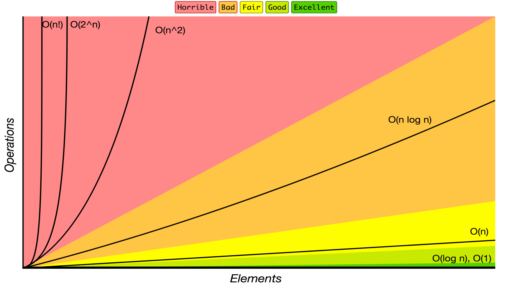

# Aglorithm in JavaScript

## Algorithm

An _Algorithm_ is a finite sequence of well-defined, computer-implementable instructions, typically to solve a class of problems or to perform a computation.

## Big O Notation

_Big O notation_ is used to classify algorithms according to how their running time or space requirements grow as the input size grows.

Big O notations and their performance comparisons

| Big O Notation | Computations for 10 elements | Computations for 100 elements | Computations for 1000 elements |
| :------------- | :--------------------------- | :---------------------------- | :----------------------------- |
| **O(1)**       | 1                            | 1                             | 1                              |
| **O(log N)**   | 3                            | 6                             | 9                              |
| **O(N)**       | 10                           | 100                           | 1000                           |
| **O(N log N)** | 30                           | 600                           | 9000                           |
| **O(N^2)**     | 100                          | 10000                         | 1000000                        |
| **O(2^N)**     | 1024                         | 1.26e+29                      | 1.07e+301                      |
| **O(N!)**      | 3628800                      | 9.3e+157                      | 4.02e+2567                     |